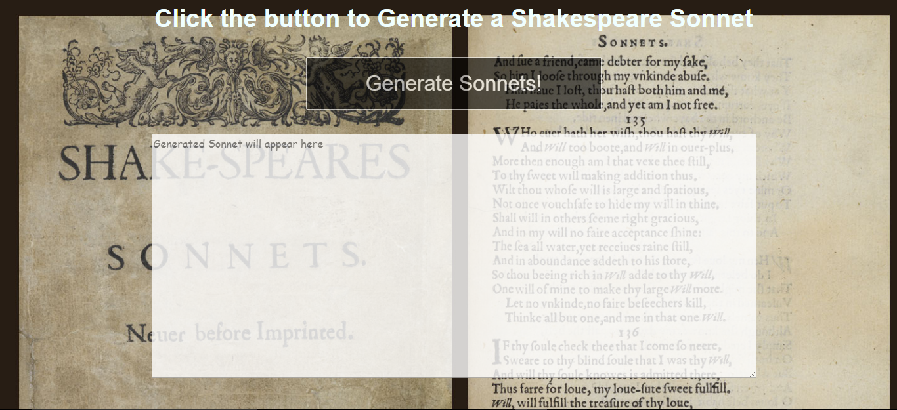
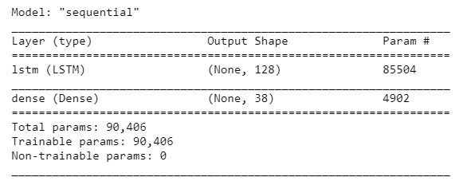
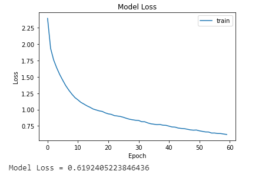

# Shakespeare-Sonnets-Generation

Shakespeare Sonnets Generator using a Long Short Term Memory (LSTM) Recurrent Neural Network (RNN).

Try it yourself here : https://shakespeare-sonnets-generator.herokuapp.com/

This Model is based on all of 154 Shakespeares Sonnets as its [dataset.](shakespeare_sonnets_dataset.txt)

The book can be found under Project Gutenberg:
https://www.gutenberg.org/ebooks/1041

## Getting Started

### Requirements
> Python (3.x)

> Tensorflow (2.0.1)

> Numpy (1.18.4)

> Flask (1.1.2)

> Gunicorn (for heroku deployment)

Install all the requirements with pip as follows:

`pip install -r requirements.txt`

### Clone
Clone this repo to your local machine using 

` git clone https://github.com/premnagdeo/Shakespeare-Sonnets-Generation.git `

### Usage

* Run the pretrained model (shakespeare_model.h5) in a flask app:

` python app.py `

This will start flask and you can view the output at http://127.0.0.1:5000/

* To retrain the model, run `Shakespeare-Sonnets-Generation.ipynb`

## Model

### Model Summary

### Model Loss

